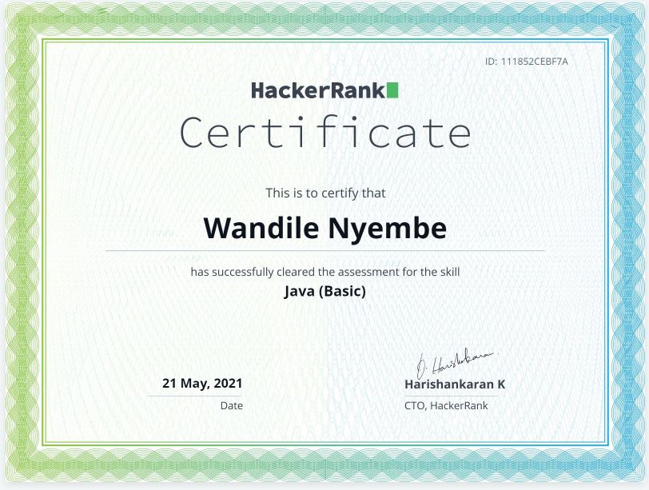
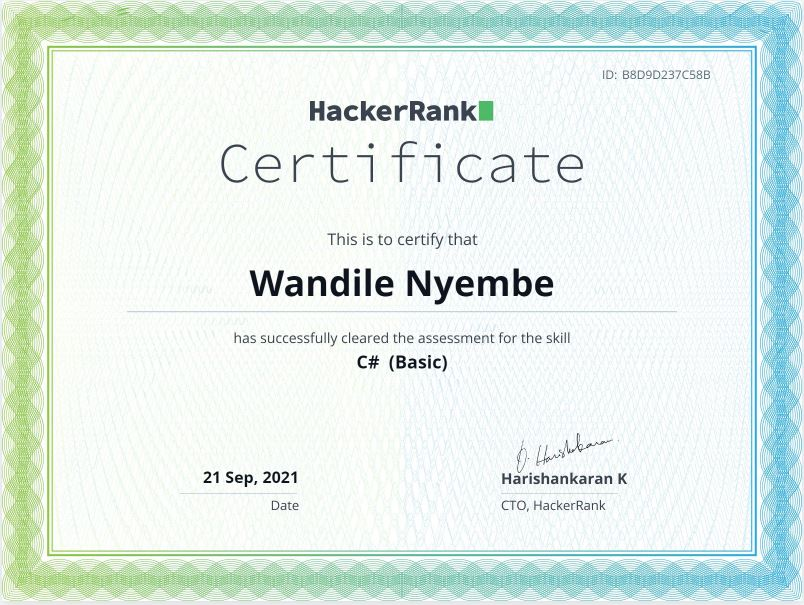

- 👋 Hi, I’m @Waynium
- 👀 I’m interested in Software Engineering, Front-end development to be precise
- 🌱 I’m currently in doing BSc degree in Computer Science 
- 📫 You can reach me via my Portfolio Website, <a href="https://wandilenyembe.netlify.app/">here</a>

  
  

                                                            

<!---
Waynium/Waynium is a ✨ special ✨ repository because its `README.md` (this file) appears on your GitHub profile.
You can click the Preview link to take a look at your changes.
--->
